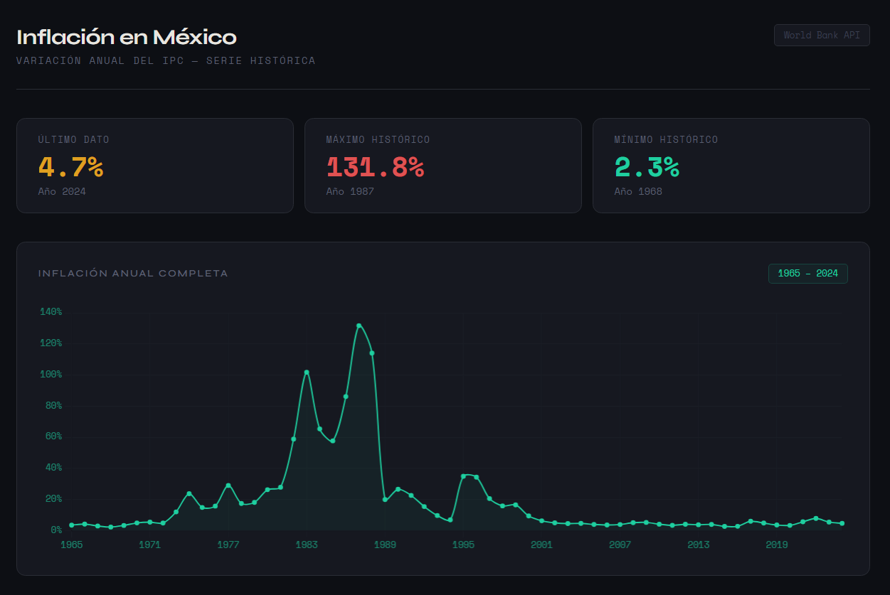

# mx-inflation-dashboard

> Interactive dashboard visualizing Mexico's historical inflation data via World Bank API — built with vanilla JS and Chart.js.

🌐 **[Ver proyecto en vivo](https://uriel-softdev.github.io/mx-inflation-dashboard)**

---

## Vista previa



---

## ¿Qué hace este proyecto?

Dashboard interactivo que consume datos reales de inflación anual de México directamente desde la API pública del Banco Mundial, los procesa en el navegador y los presenta en dos visualizaciones complementarias:

- **Gráfica de línea** — serie histórica completa desde los años 60 hasta el dato más reciente
- **Gráfica de barras** — últimas dos décadas con codificación de color por nivel de inflación
- **Cards de métricas** — último dato disponible, máximo histórico y mínimo histórico

---

## Stack tecnológico

| Tecnología | Uso |
|---|---|
| HTML5 / CSS3 | Estructura y estilos (dark mode, design tokens, CSS variables) |
| JavaScript (ES6+) | Lógica de consumo de API, transformación de datos y renderizado |
| Chart.js 4.4 | Visualización de datos (line chart + bar chart) |
| World Bank REST API | Fuente de datos oficial — indicador `FP.CPI.TOTL.ZG` |
| GitHub Pages | Despliegue público sin costo |

---

## Arquitectura del código

El proyecto aplica separación de responsabilidades en capas bien definidas:

```
fetchInflationData()   →  Capa de datos      — consume la API REST
processData()          →  Capa de lógica     — limpia y estructura los datos
renderMetricCards()    →  Capa de UI         — escribe las métricas en el DOM
renderHistoricalChart() → Capa de UI         — gráfica de línea histórica
renderRecentChart()    →  Capa de UI         — gráfica de barras reciente
initDashboard()        →  Orquestador        — coordina el flujo completo
```

Principios aplicados:
- **Single Responsibility** — cada función tiene una sola razón para cambiar
- **DRY** — utilidades compartidas para configuración de ejes y tooltips (`buildAxisConfig`, `buildTooltipConfig`)
- **Design tokens** — colores, umbrales y URLs centralizados en un objeto `CONFIG`
- **Manejo de errores** — feedback visual al usuario ante fallos de red

---

## Cómo ejecutarlo localmente

No requiere instalación ni dependencias. Solo clona el repo y abre el archivo:

```bash
git clone https://github.com/tuusuario/mx-inflation-dashboard.git
cd mx-inflation-dashboard
# Abre index.html en tu navegador
```

> El dashboard consume la API del Banco Mundial en tiempo real, por lo que requiere conexión a internet.

---

## Fuente de datos

**World Bank Open Data**
- Indicador: `FP.CPI.TOTL.ZG` — Inflation, consumer prices (annual %)
- País: México (MX)
- Endpoint: `https://api.worldbank.org/v2/country/MX/indicator/FP.CPI.TOTL.ZG`
- Licencia: Creative Commons Attribution 4.0 — datos de uso libre

---

## Contexto

Este proyecto es parte de mi portafolio como ingeniero de datos. El objetivo fue demostrar consumo de APIs REST, transformación de datos JSON y visualización en un entorno sin frameworks, aplicando buenas prácticas de organización de código.

**Proyectos relacionados en este portafolio:**
- 🔜 ETL Pipeline en Python (en construcción)
- 🔜 PL/SQL Advanced Queries (en construcción)

---

## Autor

**Uriel Sosa**
Ingeniero de Datos — Oracle PL/SQL · Informatica PowerCenter · Python ETL · SQL Server

[](https://www.linkedin.com/in/huitzil-uriel-sosa-garc%C3%ADa-b0060b3b8/)
[](https://github.com/uriel-softdev/)
